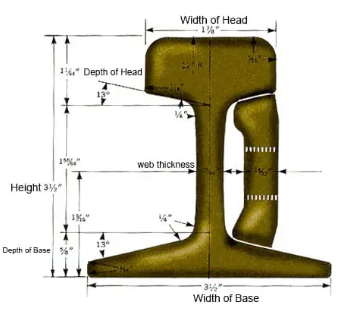

# SPECTRE
Structural Piezo Evaluation Crawler for Track Railway Examination

## Indigenous Track Monitoring for Railways
Create a low-cost, IoT-based hardware device for Indian Railways to monitor track health and detect fractures in real-time.

---
## Constraints
1. Budget: 5k INR (low cost requirement)
1. Sampling rate: >1kHz
1. Crawl speed: No max limit, crawler stops for sensing so movement can be as fast as possible
1. Logging precision: 2x piezo pad length
1. Power: TBD (based on components)
1. Weight: under 500g

---
## Mechanical construction
- Inverted U shaped crawler with wheels on the vertical axis on either side
- It can split from the middle for assembling onto the track
- On the top face, the microcontroller is mounted, along with the sensors that monitor the top surface. Above this, the battery pack is mounted and finally, the solar panel is mounted
- On either side, there are two wheels separated by the the sensors for monitoring the side surfaces
- In the space between the wheels, an emitter is placed on one side and the sensor is placed on the other side

---
## Methodology:
1. Surface cracks are detected by:
    - IR mapping + Logic/ML (used for vaildating piezo data)
1. Internal cracks are detected by:
    - Piezo vibration (detects both surface and internal). Different sized faults will respond deeply with different frequency vibrations. So we will have a ramp function for input voltage frequency. The receiver measures the full pattern and classifies anomalies appropriately
1. The detection unit will crawl along the track at a slow pace for accurate sensing
1. Fault spots are tracked by measuring distance travelled using the motors' encoders and logged into an inbuilt SD card as

    |Distance from start|Type of fault|Confidence score|
    |---|---|---|

1. Data is transferred at each station via rail wifi
1. High grip silicone wheels will be used, so that surface finish (like dirt, rust etc) does not affect traversing
1. Battery is managed using an onboard lipo battery. Solar charging is feasible. If battery capacity falls below a threshold, it requests charging at the next station
